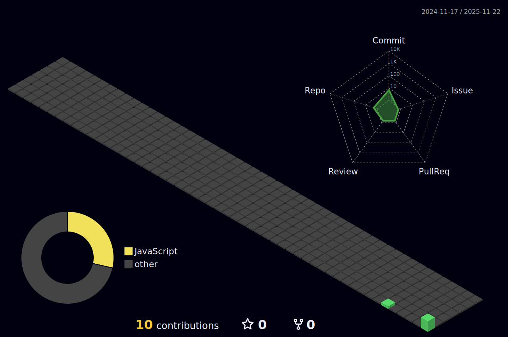

<h1 align="center">Gustavo Santos</h1>

  Estudante de Tecnologia da Informação · Focado em Cloud, Python e Análise de Dados

---

---

## Sobre

- Estudante de Tecnologia da Informação com foco em serviços em nuvem, Python, Power BI e análise de dados
- Formação complementar no SENAI "Ary Torres" em cursos voltados para cloud, programação e dados
- Conhecimentos em fundamentos de computação em nuvem (AZ-900) e automação com Python
- Interesse em infraestrutura, análise de dados, soluções cloud e boas práticas tecnológicas
- Em constante evolução no ecossistema Microsoft, Python e ferramentas de dados

## Formação em destaque

- **PL-900 – Tecnologia da Informação (SENAI “Ary Torres”)**  
  Competências: Python · Serviços em Nuvem · Análise de Dados

- **Power BI – Tecnologia da Informação (SENAI “Ary Torres”)**

- **Programação em Python – Tecnologia da Informação (SENAI “Ary Torres”)**  
  Competências: Serviços em Nuvem

- **Implementação em Serviços em Nuvem – Microsoft AZ-900 (SENAI “Ary Torres”)**

## Contato

- **LinkedIn:** https://linkedin.com/in/gustavo-santos-83ab8027b  
- **E-mail:** gsvsantos2008@gmail.com  
- **Telefone:** (11) 96846-3965

---

> O conhecimento transforma caminhos e constrói oportunidades.
